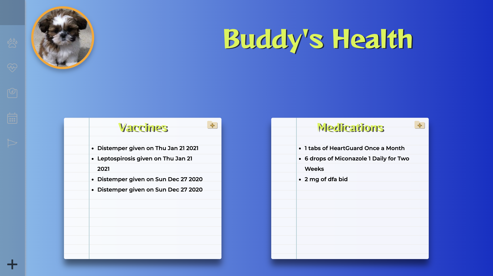

# Welcome to Pet Portal

## Description

Pet Portal allows you to track and document all of your pets health and life events. You're able to keep track of appointments(vet, groomer, boarding, petsitter etc). It also allows the owner to log vaccines, medications, weight and length to keep track of their pets health. Lastly allows owners to upload images for important milestones/events.

# Built With

  
   

## Splashpage

## Homepage

## Pet Overview 

## Pet Health

## Pet Growth

## Backend

Database Schema

